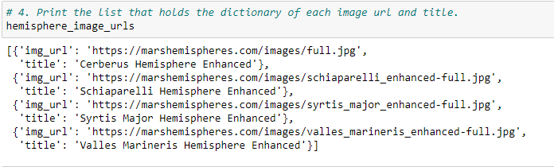
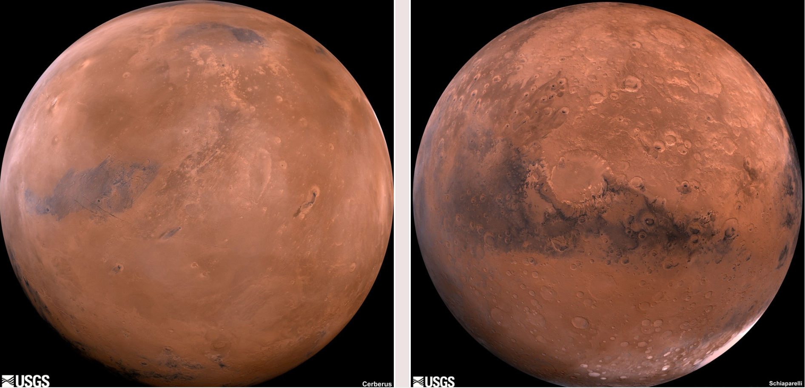
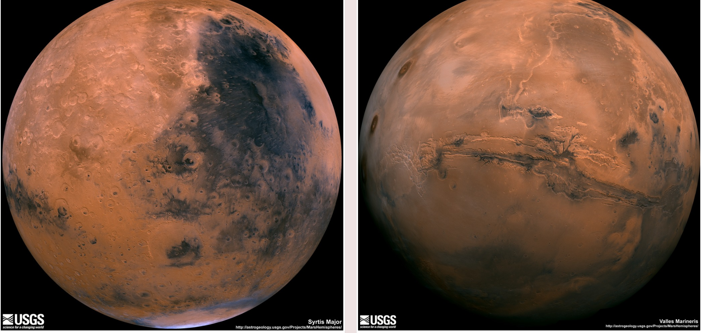
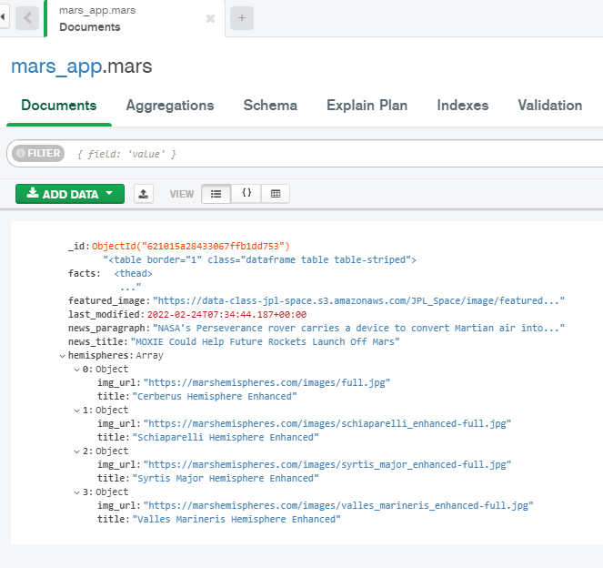
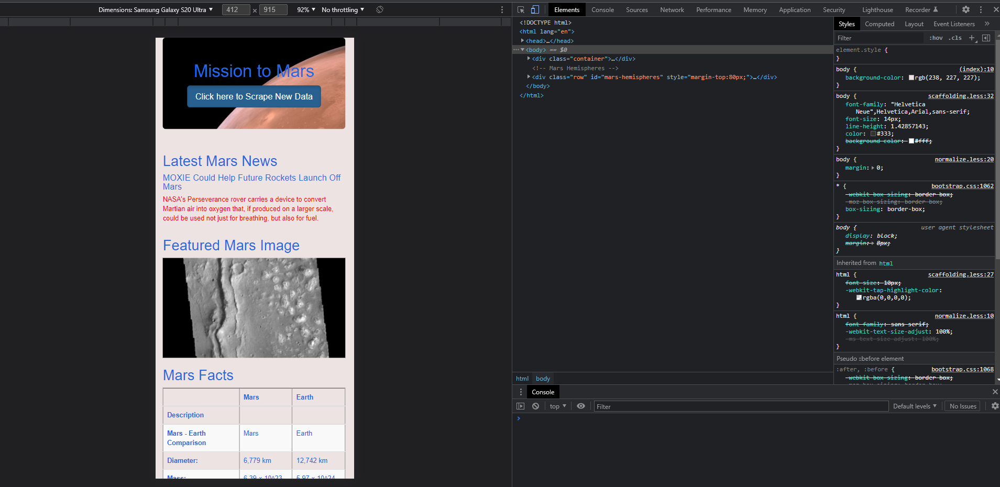

# Mission-to-Mars
Web Scraping with HTML/CSS

#Purpose
To help Robin to build an APP to scrape data from websites for our mission to mars projects and then create an HTML page to show our findings and make that page mobile friendly.

### Step 1 Scrape Full-Resolution Mars Hemisphere Images and Titles :

Using BeautifulSoup and Splinter, I have scraped full-resolution images of Mars’s hemispheres and the titles of those images.
Code is written in "Mission_to_Mars_Challenge.ipynb" that retrieves the full-resolution images and titles for each hemisphere image.
Then full-resolution images of the hemispheres are added to the dictionary.
Titles for the hemisphere images are added to the dictionary.
Created a list containing the dictionary of the full-resolution image URL string and title for each hemisphere image as shown below:

### Step 2 Update the Web App with Mars’s Hemisphere Images and Titles:

Using Python and HTML skills, I have added the code created in Deliverable 1 to "scraping.py" file,and updated Mongo database "mars_app", and modified "index.html" file so the webpage contains all the information collected in this module as well as the full-resolution images and titles for each hemisphere image as shown below:

Finally, made the webpage mobile-responsive by adding Bootstrap 3 components to style the webpage as shown below:

